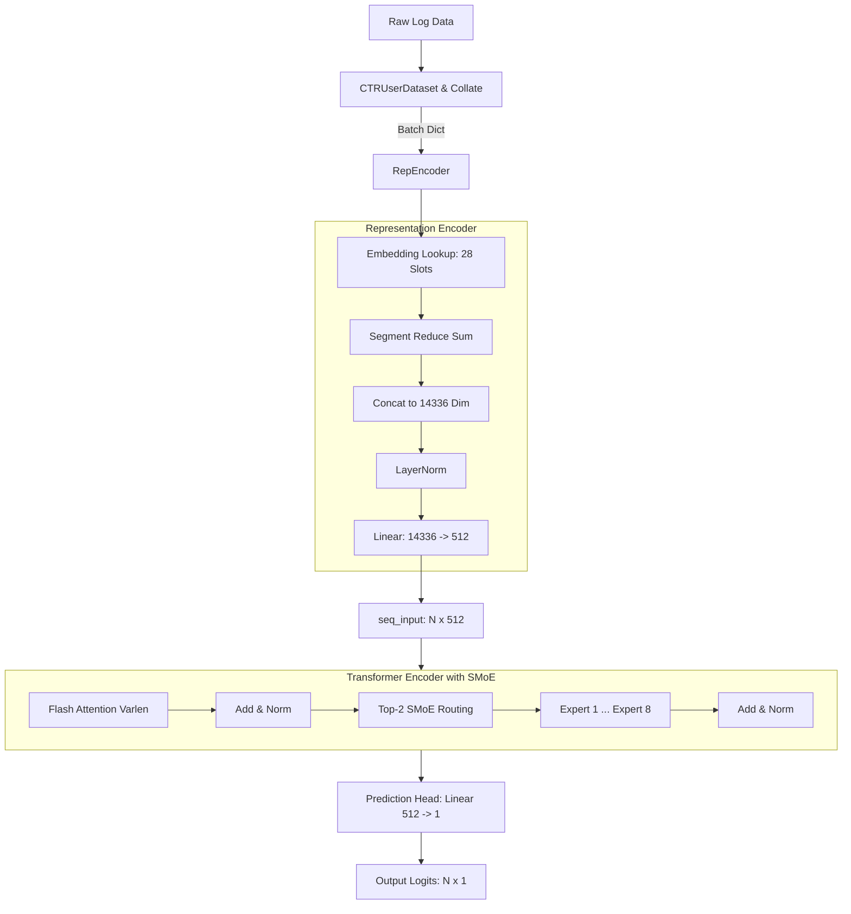

# CTR (Click-Through Rate) 模型全流程解析

这份文档详细梳理了当前工程的数据流转过程、各个阶段的数据结构（Shape）以及模型的整体架构。

---

## 1. 数据集 (Dataset)

模型的数据集定义在 `data_utils.py` 中的 `CTRUserDataset` 类里。这是一个针对推荐系统/广告排序的**用户序列数据集**。

### 原始数据概念
数据是以用户 (User) 为中心组织的，每个用户有一系列的行为序列（比如浏览了多个商品/广告）。
在推荐系统中，每个具体的物品或行为通常由多个特征槽位（Slots，通常这里是 28 个特征类别）组成，每个槽位下又包含了一个或多个具体的特征 ID（Feature ID）。

### DataLoader 与 Collate
由于不同用户的序列长度不同，同一个物品在某个槽位下的特征数量也不同（比如某个广告可能带 1 个标签，也可能带 3 个标签），所以采用了 **Flatten（展平）** 加 **Offsets（偏移量）** 的稀疏矩阵思想来进行打包。

---

## 2. 什么是 Batch？(数据格式与 Shape)

当 DataLoader 输出一个 `batch` 时，它是多个用户数据的打包聚合，表现为一个 Python 字典 (`dict`)：

| 键 (Key) | 数据类型 | Shape (形状) | 含义 |
| :--- | :--- | :--- | :--- |
| `batch['user_offsets']` | 1D Tensor | `[num_users + 1]` | 记录了这批次中每个用户序列在“总物品序列”中的起始和终止索引。 |
| `batch[1]` 到 `batch[28]` | Tuple | `(values, offsets)` | 这 28 个 Key 对应 28 个特征槽位（比如类别、标签、作者等）。 |

> **💡 核心思想：不用规整的 3D 矩阵，而是用 “1D 数组 + Offsets（偏移量）”**
> 传统的 NLP 做法是 `[Batch_Size, Seq_Len, Feature_Dim]`。但在推荐场景中：
> 1. 用户 A 看了 3 个物品，用户 B 只看了 2 个物品（序列长度不一）。
> 2. 物品 1 有 3 个标签，物品 2 只有 1 个标签（特征数量不一）。
> 如果用 3D 矩阵强行对齐，会产生大量的 Padding（填 0），极其浪费显存。因此，模型采用了把所有特征**全部首尾相接拉平为一维（Flatten）**，然后只用一条记录边界的数组（Offsets）来切分的数据结构。

### 🌰 一个极其通俗的例子

假设当前这一个 Batch 只抽到了 **2 个用户**，他们总共看了 **5 个物品（Items）**：
- **用户 1**：看了 物品_0, 物品_1, 物品_2
- **用户 2**：看了 物品_3, 物品_4

#### 1. `batch['user_offsets']` 长什么样？
它是用来划分**用户和物品**归属关系的：
* `user_offsets = [0, 3, 5]`
* **怎么读？** 
  * 第 1 个用户的物品范围是索引 `0` 到 `3`（不含边界），也就是物品 0、1、2。
  * 第 2 个用户的物品范围是索引 `3` 到 `5`，也就是物品 3、4。

#### 2. `batch[某个特征槽]` 长什么样？
假设我们在看 **槽位 1（例如：视频标签）**。
这 5 个物品带有的标签数量是不一样的：
- 物品_0 有 2 个标签：[A, B]
- 物品_1 有 1 个标签：[C]
- 物品_2 有 3 个标签：[D, E, F]
- 物品_3 有 1 个标签：[G]
- 物品_4 有 1 个标签：[H]

总共有 8 个具体的标签特征。在代码中，`batch[1]` 是一个元组 `(values, offsets)`：
* **`values` = `[A, B, C, D, E, F, G, H]`** （Shape 为 `[8]`，所有特征全部拉平首尾相接）
* **`offsets` = `[0, 2, 3, 6, 7, 8]`** （Shape 为 `[5 + 1]`，指示物品切分边界）
* **怎么读？**
  * 物品_0 的标签在 `values` 里的范围是 `0` 到 `2` $\rightarrow$ `[A, B]`
  * 物品_1 的标签范围是 `2` 到 `3` $\rightarrow$ `[C]`
  * 物品_2 的标签范围是 `3` 到 `6` $\rightarrow$ `[D, E, F]`

**为什么这么做？**
在进入 `RepEncoder` 时，模型会对 `values` 里的 `[A..H]` 全部过一遍 Embedding 查表，得到 8 个高维向量，然后直接调用牛逼的底层算子 `torch.segment_reduce(reduce='sum')`，把这个扁平的向量数组按照 `offsets` 瞬间分组并求和池化。这就是这段代码极高效率的核心秘密！

---

## 3. 模型前向传播流程 (Forward Pipeline)

模型的入口是 `models.py` 里的 `CTRModel`，整体分为三个大阶段：**表示编码 (RepEncoder)** -> **序列编码 (SeqEncoder / Transformer)** -> **预测头 (Prediction)**。

### 阶段一：RepEncoder (特征聚合映射)
**目标：将极其稀疏的离散特征，映射并压缩成固定长度的稠密向量。**

1. **Embedding 查找**：遍历 28 个特征槽位，对每个槽位的 `values` 查表，得到 `[total_features, 512]` 的词嵌入。
2. **Segment Reduce (池化)**：利用 `offsets` 边界，使用 `torch.segment_reduce(reduce='sum')`，将属于同一个物品的多个特征嵌入进行求和池化。
   * **此时 Shape 变成了** `[num_items_in_batch, 512]`
3. **特征拼接 (Concat)**：把 28 个槽位池化后的结果拼接在一起。
   * **此时 Shape 变成了** `[num_items_in_batch, 14336]`  *(注: 28 × 512 = 14336)*
4. **降维压缩**：通过一个 `LayerNorm`，然后经过一个巨大的全连接层 `Linear(14336, 512)` 进行特征交叉降维。
   * **输出 Shape (seq_input)**：`[num_items_in_batch, 512]`

*(我们在 W8A8 量化优化中，主要提速的就是最后这个计算量极大的 `[num_items, 14336] @ [14336, 512]` 矩阵乘法)*

---

### 阶段二：TransformerEncoder (带 SMoE 的用户序列建模)
**目标：捕获同一用户浏览物品前后的时序因果关系。**

1. **结构变换**：为了适配 Attention 接口，把刚才的输入强行塞入一个假 Batch 维度：`[1, num_items_in_batch, 512]`。
2. **Flash Attention (Varlen 模式)**：由于我们把多个用户的序列拼在了一起，必须用到 `batch['user_offsets']`。
   * 它利用 Flash Attention 的 `cu_seqlens` (Cumulative Sequence Lengths) 特性，让 Attention 只在同一个用户的历史行为内部发生，严格隔离其他用户。同时采用 Causal Mask (因果掩码)，只允许当前物品关注之前的物品。
3. **稀疏专家网络 (SMoE)**：在每个 Transformer 层的 FFN 部分，使用了 Top-2 路由的混合专家网络。
   * 模型会为当前的 Token (物品) 计算各个专家的权重分数，选取 Top-2 的专家处理数据。这大幅提高了模型容量。
4. **输出 Shape**：仍然保持不变，为 `[1, num_items_in_batch, 512]`。

---

### 阶段三：Prediction Head (点击率预测)
**目标：输出每个物品被点击的 Logits（未经过 Sigmoid 的概率值）。**

1. **剥离假维度**：去掉多余的 batch 维度，恢复成 `[num_items_in_batch, 512]`。
2. **全连接映射**：通过一层极其简单的 `Linear(512, 1)`。
   * **输出 Shape (pred)**：`[num_items_in_batch, 1]`。
3. **数值裁剪**：通过 `torch.clamp(pred, -15.0, 15.0)` 防止数值爆炸，最后作为 `pred_logits` 返回。同时会返回由于 SMoE 路由产生的负载均衡损失（`moe_loss`）。

---

### 整体架构图总结

